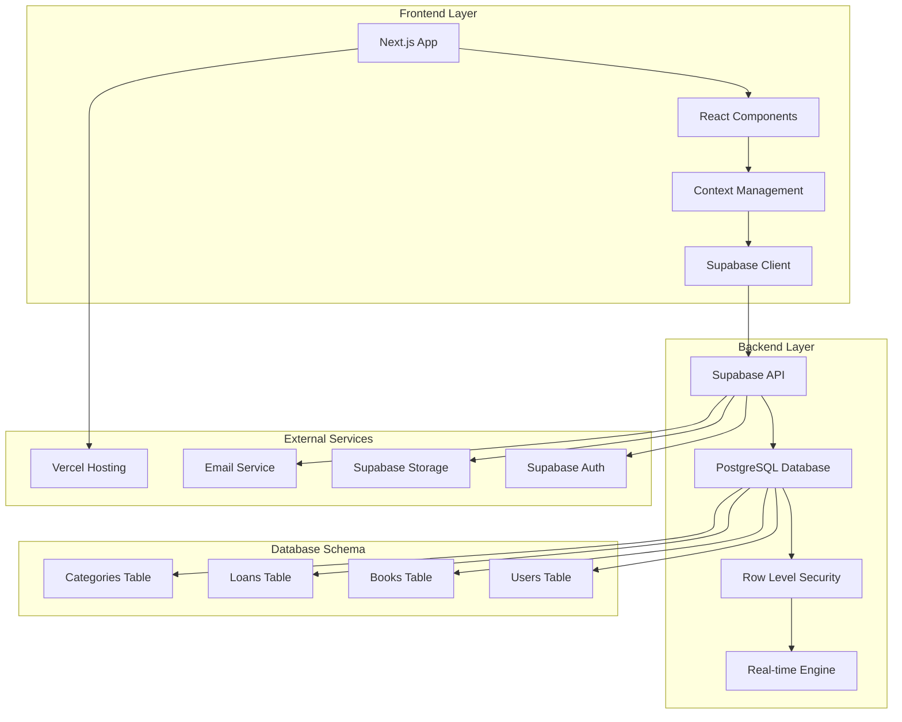
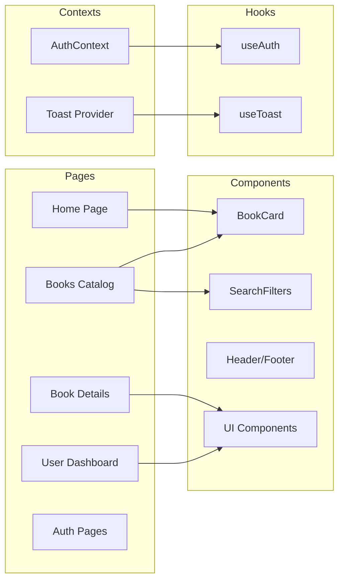
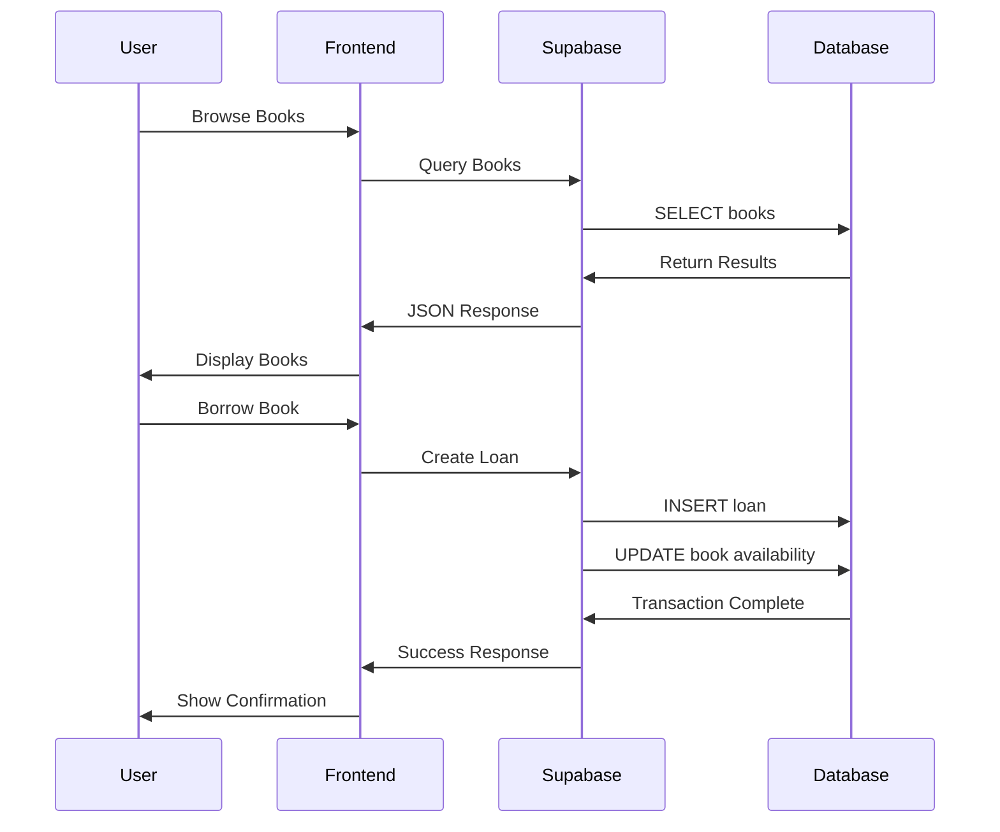

<div align="center"><a name="readme-top"></a>

[](#)

# 📚 Library Management System<br/><h3>Modern Digital Library Solution</h3>

A comprehensive web-based library management system that revolutionizes how libraries operate and how users interact with library services.<br/>
Built with Next.js 15, TypeScript, and Supabase, featuring real-time updates and intuitive user experience.<br/>
One-click **FREE** deployment for your digital library transformation.

[Live Demo][demo-link] · [Documentation][docs-link] · [Report Bug][issues-link] · [Request Feature][issues-link]

<br/>

[][demo-link]

<br/>

<!-- SHIELD GROUP -->

[![][github-release-shield]][github-release-link]
[![][vercel-shield]][vercel-link]
[![][github-stars-shield]][github-stars-link]
[![][github-forks-shield]][github-forks-link]
[![][github-issues-shield]][github-issues-link]
[![][github-license-shield]][github-license-link]

**Share Repository**

[![][share-x-shield]][share-x-link]
[![][share-linkedin-shield]][share-linkedin-link]
[![][share-reddit-shield]][share-reddit-link]

<sup>🌟 Transforming library management for the digital age. Built for librarians, students, and book enthusiasts.</sup>

[![][github-trending-shield]][github-trending-url]

## 📸 Project Screenshots

> [!TIP]
> Experience the modern, intuitive interface designed for both librarians and library users.

<div align="center">
  
  <p><em>User Dashboard - Complete overview of borrowed books and library statistics</em></p>
</div>

<div align="center">
  
  
  <p><em>Book Catalog and Detailed Book Information</em></p>
</div>

<details>
<summary><kbd>📱 More Screenshots</kbd></summary>

<div align="center">
  
  <p><em>Secure Authentication System</em></p>
</div>

<div align="center">
  
  <p><em>Advanced Search and Filtering</em></p>
</div>

</details>

**Tech Stack Showcase:**

<div align="center">

 
 
 
 
 
 

</div>

</div>

> [!IMPORTANT]
> This project demonstrates modern full-stack development practices with Next.js 15 and Supabase. It combines server-side rendering with real-time database operations to provide a seamless library management experience. Features include user authentication, book catalog management, borrowing system, and comprehensive dashboard analytics.

<details>
<summary><kbd>📑 Table of Contents</kbd></summary>

#### TOC

- [📚 Library Management SystemModern Digital Library Solution](#-library-management-systemmodern-digital-library-solution)
  - [📸 Project Screenshots](#-project-screenshots)
      - [TOC](#toc)
      - [](#)
  - [🌟 Introduction](#-introduction)
  - [✨ Key Features](#-key-features)
    - [`1` Smart Book Management](#1-smart-book-management)
    - [`2` User-Centric Experience](#2-user-centric-experience)
    - [`*` Additional Features](#-additional-features)
  - [🛠️ Tech Stack](#️-tech-stack)
  - [🏗️ Architecture](#️-architecture)
    - [System Architecture](#system-architecture)
    - [Component Architecture](#component-architecture)
    - [Data Flow](#data-flow)
    - [Component Structure](#component-structure)
  - [⚡️ Performance](#️-performance)
    - [Performance Metrics](#performance-metrics)
  - [🚀 Getting Started](#-getting-started)
    - [Prerequisites](#prerequisites)
    - [Quick Installation](#quick-installation)
    - [Environment Setup](#environment-setup)
    - [Development Mode](#development-mode)
  - [🛳 Deployment](#-deployment)
    - [`A` Vercel Deployment](#a-vercel-deployment)
    - [`B` Docker Deployment](#b-docker-deployment)
    - [`C` Environment Variables](#c-environment-variables)
  - [📖 Usage Guide](#-usage-guide)
    - [For Library Users](#for-library-users)
    - [For Administrators](#for-administrators)
    - [API Reference](#api-reference)
  - [🔌 Integrations](#-integrations)
  - [⌨️ Development](#️-development)
    - [Local Development](#local-development)
    - [Adding Features](#adding-features)
    - [Testing](#testing)
  - [🤝 Contributing](#-contributing)
  - [📄 License](#-license)
  - [👥 Author](#-author)

####

<br/>

</details>

## 🌟 Introduction

We are passionate about modernizing library management through innovative technology solutions. This comprehensive library management system bridges the gap between traditional library operations and modern digital expectations, providing both librarians and users with powerful, intuitive tools for managing and accessing library resources.

Whether you're a library administrator seeking to streamline operations or a user looking for seamless book discovery and borrowing experiences, this system delivers enterprise-grade functionality with consumer-friendly design.

> [!NOTE]
> - Node.js >= 18.0 required
> - Supabase account required for database and authentication
> - Modern web browser with JavaScript enabled
> - Email service for notifications (optional)

| [![][demo-shield-badge]][demo-link]   | Experience the system firsthand with our live demo - no installation required!                           |
| :------------------------------------ | :--------------------------------------------------------------------------------------------- |
| [![][discord-shield-badge]][discord-link] | Join our community of developers and library professionals. |

> [!TIP]
> **⭐ Star us** to receive notifications about new features and updates!

[![][image-star]][github-stars-link]

<details>
  <summary><kbd>⭐ Star History</kbd></summary>
  <picture>
    <source media="(prefers-color-scheme: dark)" srcset="https://api.star-history.com/svg?repos=ChanMeng666%2Flibrary-management-system&theme=dark&type=Date">
    
  </picture>
</details>

## ✨ Key Features

[![][image-feat-core]][docs-feat-core]

### `1` [Smart Book Management][docs-feat-core]

Experience next-generation library catalog management with intelligent search, real-time availability tracking, and automated inventory management. Our advanced system provides comprehensive book information management with seamless user interactions.

<div align="center">
  
  <p><em>Advanced Book Catalog with Search and Filtering</em></p>
</div>

Key capabilities include:
- 🔍 **Smart Search**: Advanced search by title, author, ISBN, and categories
- 📚 **Real-time Inventory**: Live tracking of book availability and stock levels
- 🏷️ **Category Management**: Organized book classification system
- 📱 **Responsive Design**: Seamless experience across all devices
- 🖼️ **Cover Management**: Support for book cover images and placeholders

> [!TIP]
> The search system supports partial matches and fuzzy search, making it easy for users to find books even with incomplete information.

[![][back-to-top]](#readme-top)

### `2` [User-Centric Experience][docs-feat-advanced]

Revolutionary user dashboard that transforms how library patrons interact with library services. With personalized borrowing history, real-time notifications, and intuitive book management, users can efficiently manage their library experience.

<div align="center">
  
  <p><em>Comprehensive User Dashboard with Statistics and Borrowed Books</em></p>
</div>

**Dashboard Features:**
- **Personal Statistics**: Track borrowing history and library engagement
- **Active Loans**: Manage currently borrowed books with due dates
- **Overdue Alerts**: Visual indicators for overdue items
- **Quick Actions**: One-click book returns and renewals

[![][back-to-top]](#readme-top)

### `*` Additional Features

Beyond the core functionality, this system includes:

- [x] 🔐 **Secure Authentication**: Email-based authentication with Supabase Auth
- [x] 📊 **Analytics Dashboard**: Comprehensive statistics and reporting
- [x] 🔄 **Real-time Updates**: Live synchronization across all connected devices
- [x] 📱 **Mobile Responsive**: Perfect experience on smartphones and tablets
- [x] 🌙 **Dark Mode**: Eye-friendly dark theme option
- [x] 🔔 **Smart Notifications**: Toast notifications for all user actions
- [x] 📈 **Progress Tracking**: Visual progress indicators for all operations
- [x] 🛡️ **Data Protection**: Secure data handling with PostgreSQL and RLS

> ✨ More features are continuously being added based on user feedback and library needs.

<div align="right">

[![][back-to-top]](#readme-top)

</div>

## 🛠️ Tech Stack

<div align="center">
  <table>
    <tr>
      <td align="center" width="96">
        
        <br>Next.js 15
      </td>
      <td align="center" width="96">
        
        <br>React 18
      </td>
      <td align="center" width="96">
        
        <br>TypeScript 5
      </td>
      <td align="center" width="96">
        
        <br>Supabase
      </td>
      <td align="center" width="96">
        
        <br>PostgreSQL
      </td>
      <td align="center" width="96">
        
        <br>TailwindCSS
      </td>
    </tr>
  </table>
</div>

**Frontend Stack:**
- **Framework**: Next.js 15 with App Router for optimal performance
- **Language**: TypeScript for type safety and better development experience
- **Styling**: TailwindCSS with custom design system
- **UI Components**: Radix UI primitives with custom styling
- **Icons**: Lucide React for consistent iconography

**Backend & Database:**
- **Backend-as-a-Service**: Supabase for authentication and database
- **Database**: PostgreSQL with Row Level Security (RLS)
- **Real-time**: Supabase real-time subscriptions
- **Authentication**: Supabase Auth with email/password
- **Storage**: Supabase Storage for file management

**Development Tools:**
- **Build Tool**: Next.js built-in build system
- **Code Quality**: ESLint + TypeScript ESLint rules
- **Form Handling**: React Hook Form with Zod validation
- **Date Management**: date-fns for date operations
- **Deployment**: Vercel for seamless deployment

> [!TIP]
> Each technology was selected for production readiness, developer experience, and seamless integration with the overall architecture.

## 🏗️ Architecture

### System Architecture

> [!TIP]
> This architecture supports real-time updates and scalable user management, making it suitable for libraries of all sizes.



### Component Architecture



### Data Flow



### Component Structure

```
src/
├── app/                    # Next.js App Router
│   ├── books/             # Book-related pages
│   │   ├── [id]/         # Dynamic book detail page
│   │   └── page.tsx      # Book catalog page
│   ├── dashboard/        # User dashboard
│   ├── login/           # Authentication pages
│   ├── register/        # User registration
│   └── layout.tsx       # Root layout
├── components/          # Reusable components
│   ├── books/          # Book-specific components
│   ├── layout/         # Layout components
│   └── ui/            # Base UI components
├── contexts/           # React contexts
├── hooks/             # Custom hooks
├── lib/               # Utility libraries
├── types/             # TypeScript definitions
└── styles/            # Global styles
```

## ⚡️ Performance

> [!NOTE]
> Performance optimizations ensure fast loading times and smooth user experience across all devices.

### Performance Metrics

**Key Performance Indicators:**
- ⚡ **Lightning Fast**: < 2s initial page load
- 🚀 **Instant Navigation**: Client-side routing with prefetching
- 📱 **Mobile Optimized**: Perfect scores on mobile devices
- 🔄 **Real-time Updates**: < 100ms database synchronization
- 📊 **Efficient Rendering**: Optimized React components

**Optimization Techniques:**
- 🎯 **Image Optimization**: Next.js Image component with lazy loading
- 📦 **Code Splitting**: Automatic route-based code splitting
- 🗄️ **Database Optimization**: Efficient PostgreSQL queries with indexes
- 🔄 **Caching Strategy**: Static generation where possible
- 📱 **Progressive Enhancement**: Works without JavaScript

## 🚀 Getting Started

### Prerequisites

> [!IMPORTANT]
> Ensure you have the following installed and configured:

- **Node.js** 18.0+ ([Download](https://nodejs.org/))
- **npm/yarn/pnpm** package manager
- **Git** ([Download](https://git-scm.com/))
- **Supabase Account** ([Sign up](https://supabase.com/))

### Quick Installation

**1. Clone Repository**

```bash
git clone https://github.com/ChanMeng666/library-management-system.git
cd library-management-system
```

**2. Install Dependencies**

```bash
# Using npm
npm install

# Using yarn
yarn install

# Using pnpm (recommended)
pnpm install
```

**3. Environment Setup**

```bash
# Copy environment template
cp .env.example .env.local

# Edit environment variables
nano .env.local
```

**4. Supabase Setup**

1. Create a new project on [Supabase](https://supabase.com/)
2. Get your project URL and anon key
3. Set up your database schema (see database setup guide)

**5. Start Development**

```bash
npm run dev
```

🎉 **Success!** Open [http://localhost:3000](http://localhost:3000) to view the application.

### Environment Setup

Create `.env.local` file with the following variables:

```bash
# Supabase Configuration
NEXT_PUBLIC_SUPABASE_URL=your-supabase-project-url
NEXT_PUBLIC_SUPABASE_ANON_KEY=your-supabase-anon-key

# Optional: Additional Configuration
NEXT_PUBLIC_APP_URL=http://localhost:3000
```

> [!TIP]
> Get your Supabase credentials from your project settings in the Supabase dashboard.

### Development Mode

```bash
# Start development server
npm run dev

# Build for production
npm run build

# Start production server
npm start

# Run linting
npm run lint
```

## 🛳 Deployment

> [!IMPORTANT]
> The application is optimized for deployment on Vercel, but can be deployed on any platform that supports Next.js.

### `A` Vercel Deployment

**One-Click Deploy:**

[](https://vercel.com/new/clone?repository-url=https%3A%2F%2Fgithub.com%2FChanMeng666%2Flibrary-management-system)

**Manual Deployment:**

```bash
# Install Vercel CLI
npm i -g vercel

# Deploy
vercel --prod
```

### `B` Docker Deployment

```bash
# Build Docker image
docker build -t library-management-system .

# Run container
docker run -p 3000:3000 library-management-system
```

### `C` Environment Variables

> [!WARNING]
> Never commit sensitive environment variables to version control. Use Vercel's environment variables settings for production.

| Variable | Description | Required | Example |
|----------|-------------|----------|---------|
| `NEXT_PUBLIC_SUPABASE_URL` | Supabase project URL | ✅ | `https://xxx.supabase.co` |
| `NEXT_PUBLIC_SUPABASE_ANON_KEY` | Supabase anonymous key | ✅ | `eyJhbGciOiJIUzI1NiIsInR5cCI6IkpXVCJ9...` |
| `NEXT_PUBLIC_APP_URL` | Application URL | 🔶 | `https://your-app.vercel.app` |

> [!NOTE]
> ✅ Required, 🔶 Optional

## 📖 Usage Guide

### For Library Users

**Getting Started:**

1. **Create Account** - Register with your email address
2. **Browse Books** - Explore the book catalog with advanced search
3. **Borrow Books** - Click "Borrow" on available books
4. **Manage Loans** - Track your borrowed books in the dashboard
5. **Return Books** - Use the dashboard to return books

**Key Features:**
- 📚 **Book Discovery**: Search by title, author, or ISBN
- 🔍 **Advanced Filtering**: Filter by categories and availability
- 📊 **Personal Dashboard**: View borrowed books and statistics
- 🔔 **Due Date Tracking**: Never miss a return date
- 📱 **Mobile Access**: Use on any device, anywhere

### For Administrators

**System Management:**
- 👥 **User Management**: Monitor user accounts and activities
- 📚 **Inventory Control**: Track book availability and status
- 📈 **Analytics**: View system usage and statistics
- 🔧 **Configuration**: Manage system settings and preferences

### API Reference

> [!TIP]
> The system uses Supabase's auto-generated API with Row Level Security for data protection.

**Core Database Tables:**
- `books` - Book information and inventory
- `users` - User profiles and authentication
- `loans` - Borrowing records and transactions
- `categories` - Book classification system

**Key Operations:**
```javascript
// Search books
const { data: books } = await supabase
  .from('books')
  .select('*')
  .ilike('title', `%${searchTerm}%`)

// Borrow book
const { data: loan } = await supabase
  .from('loans')
  .insert([{
    user_id: userId,
    book_id: bookId,
    due_date: dueDate
  }])
```

## 🔌 Integrations

The system integrates seamlessly with modern web services:

| Service | Purpose | Status | Documentation |
|---------|---------|--------|---------------|
| **Supabase** | Database & Auth | ✅ Active | [Setup Guide](docs/supabase.md) |
| **Vercel** | Hosting & Deployment | ✅ Active | [Deploy Guide](docs/vercel.md) |
| **Radix UI** | Component Library | ✅ Active | [Component Docs](docs/components.md) |
| **TailwindCSS** | Styling Framework | ✅ Active | [Style Guide](docs/styles.md) |

## ⌨️ Development

### Local Development

**Setup Development Environment:**

```bash
# Clone and install
git clone https://github.com/ChanMeng666/library-management-system.git
cd library-management-system
npm install

# Set up environment
cp .env.example .env.local
# Edit .env.local with your Supabase credentials

# Start development
npm run dev
```

**Development Scripts:**

```bash
# Development
npm run dev          # Start dev server
npm run build        # Build for production
npm run start        # Start production server

# Code Quality
npm run lint         # Run ESLint
npm run type-check   # TypeScript check

# Database (if using local Supabase)
npx supabase start   # Start local Supabase
npx supabase stop    # Stop local Supabase
```

### Adding Features

> [!TIP]
> Follow the established patterns when adding new features to maintain code consistency.

**Feature Development Workflow:**

1. **Create Feature Branch**: `git checkout -b feature/new-feature`
2. **Develop Component**: Add components in appropriate directories
3. **Add Types**: Update TypeScript definitions
4. **Test Functionality**: Ensure all features work correctly
5. **Update Documentation**: Add relevant documentation
6. **Submit Pull Request**: Follow PR template

### Testing

**Manual Testing Checklist:**
- [ ] User authentication (sign up, sign in, sign out)
- [ ] Book browsing and search functionality
- [ ] Book borrowing and returning process
- [ ] Dashboard statistics and display
- [ ] Responsive design on mobile devices
- [ ] Error handling and edge cases

## 🤝 Contributing

We welcome contributions to improve the Library Management System! Here's how you can help:

**Development Process:**

1. **Fork the Repository**
2. **Create Feature Branch** (`git checkout -b feature/AmazingFeature`)
3. **Commit Changes** (`git commit -m 'Add some AmazingFeature'`)
4. **Push to Branch** (`git push origin feature/AmazingFeature`)
5. **Open Pull Request**

**Contribution Guidelines:**
- Follow TypeScript best practices
- Maintain consistent code style
- Add comments for complex logic
- Test your changes thoroughly
- Update documentation as needed

**Types of Contributions:**
- 🐛 **Bug Reports**: Help us identify and fix issues
- 💡 **Feature Requests**: Suggest new functionality
- 📚 **Documentation**: Improve our documentation
- 🔧 **Code Improvements**: Optimize existing code

[![][pr-welcome-shield]][pr-welcome-link]

<a href="https://github.com/ChanMeng666/library-management-system/graphs/contributors" target="_blank">
  <table>
    <tr>
      <th colspan="2">
        <br><br><br>
      </th>
    </tr>
  </table>
</a>

## 📄 License

This project is licensed under the MIT License - see the [LICENSE](LICENSE) file for details.

**Open Source Benefits:**
- ✅ Commercial use allowed
- ✅ Modification allowed
- ✅ Distribution allowed
- ✅ Private use allowed

## 👥 Author

<div align="center">
  <table>
    <tr>
      <td align="center">
        <a href="https://github.com/ChanMeng666">
          
          <br />
          <sub><b>Chan Meng</b></sub>
        </a>
        <br />
        <small>Creator & Lead Developer</small>
      </td>
    </tr>
  </table>
</div>

**Chan Meng**
-  LinkedIn: [chanmeng666](https://www.linkedin.com/in/chanmeng666/)
-  GitHub: [ChanMeng666](https://github.com/ChanMeng666)
-  Email: [chanmeng.dev@gmail.com](mailto:chanmeng.dev@gmail.com)
-  Website: [chanmeng.live](https://2d-portfolio-eta.vercel.app/)

---

<div align="center">
<strong>🚀 Transforming Library Management for the Digital Age 🌟</strong>
<br/>
<em>Empowering libraries and readers worldwide</em>
<br/><br/>

⭐ **Star us on GitHub** • 📖 **Read the Documentation** • 🐛 **Report Issues** • 💡 **Request Features** • 🤝 **Contribute**

<br/><br/>

**Made with ❤️ for the library community**


</div>

---

<!-- LINK DEFINITIONS -->

[back-to-top]: https://img.shields.io/badge/-BACK_TO_TOP-151515?style=flat-square

<!-- Project Links -->
[demo-link]: https://library-management-system-chanmeng666.vercel.app
[docs-link]: https://github.com/ChanMeng666/library-management-system#readme
[issues-link]: https://github.com/ChanMeng666/library-management-system/issues

<!-- GitHub Links -->
[github-stars-link]: https://github.com/ChanMeng666/library-management-system/stargazers
[github-forks-link]: https://github.com/ChanMeng666/library-management-system/forks
[github-issues-link]: https://github.com/ChanMeng666/library-management-system/issues
[github-release-link]: https://github.com/ChanMeng666/library-management-system/releases
[github-license-link]: https://github.com/ChanMeng666/library-management-system/blob/main/LICENSE
[pr-welcome-link]: https://github.com/ChanMeng666/library-management-system/pulls

<!-- Community Links -->
[discord-link]: https://discord.gg/library-management
[vercel-link]: https://vercel.com

<!-- Documentation Links -->
[docs-feat-core]: #1-smart-book-management
[docs-feat-advanced]: #2-user-centric-experience

<!-- Shield Badges -->
[github-release-shield]: https://img.shields.io/github/v/release/ChanMeng666/library-management-system?color=369eff&labelColor=black&logo=github&style=flat-square
[vercel-shield]: https://img.shields.io/badge/vercel-online-55b467?labelColor=black&logo=vercel&style=flat-square
[discord-shield]: https://img.shields.io/discord/123456789?color=5865F2&label=discord&labelColor=black&logo=discord&logoColor=white&style=flat-square
[github-stars-shield]: https://img.shields.io/github/stars/ChanMeng666/library-management-system?color=ffcb47&labelColor=black&style=flat-square
[github-forks-shield]: https://img.shields.io/github/forks/ChanMeng666/library-management-system?color=8ae8ff&labelColor=black&style=flat-square
[github-issues-shield]: https://img.shields.io/github/issues/ChanMeng666/library-management-system?color=ff80eb&labelColor=black&style=flat-square
[github-license-shield]: https://img.shields.io/badge/license-MIT-white?labelColor=black&style=flat-square
[github-trending-shield]: https://trendshift.io/api/badge/repositories/123456
[pr-welcome-shield]: https://img.shields.io/badge/🤝_PRs_welcome-%E2%86%92-ffcb47?labelColor=black&style=for-the-badge

<!-- Badge Variants -->
[demo-shield-badge]: https://img.shields.io/badge/TRY%20DEMO-ONLINE-55b467?labelColor=black&logo=vercel&style=for-the-badge
[discord-shield-badge]: https://img.shields.io/discord/123456789?color=5865F2&label=discord&labelColor=black&logo=discord&logoColor=white&style=for-the-badge

<!-- Social Share Links -->
[share-x-link]: https://x.com/intent/tweet?hashtags=opensource,library,nextjs&text=Check%20out%20this%20amazing%20Library%20Management%20System&url=https%3A%2F%2Fgithub.com%2FChanMeng666%2Flibrary-management-system
[share-linkedin-link]: https://linkedin.com/sharing/share-offsite/?url=https://github.com/ChanMeng666/library-management-system
[share-reddit-link]: https://www.reddit.com/submit?title=Modern%20Library%20Management%20System&url=https%3A%2F%2Fgithub.com%2FChanMeng666%2Flibrary-management-system

[share-x-shield]: https://img.shields.io/badge/-share%20on%20x-black?labelColor=black&logo=x&logoColor=white&style=flat-square
[share-linkedin-shield]: https://img.shields.io/badge/-share%20on%20linkedin-black?labelColor=black&logo=linkedin&logoColor=white&style=flat-square
[share-reddit-shield]: https://img.shields.io/badge/-share%20on%20reddit-black?labelColor=black&logo=reddit&logoColor=white&style=flat-square

<!-- Images -->
[image-star]: https://via.placeholder.com/800x200/FFD700/000000?text=Star+Us+on+GitHub
[image-feat-core]: https://via.placeholder.com/800x400/4CAF50/FFFFFF?text=Smart+Book+Management

<!-- Trending -->
[github-trending-url]: https://trendshift.io/repositories/123456
</rewritten_file>
